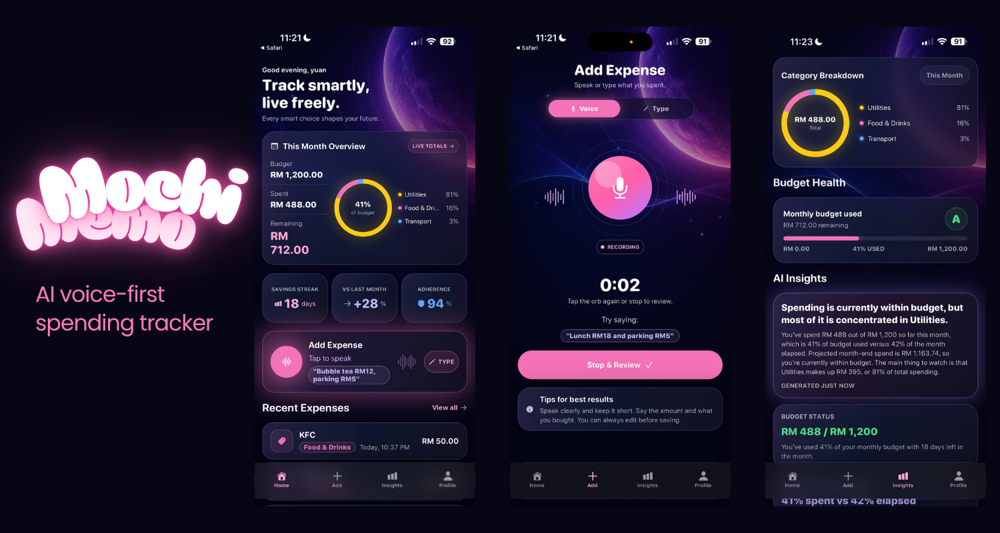
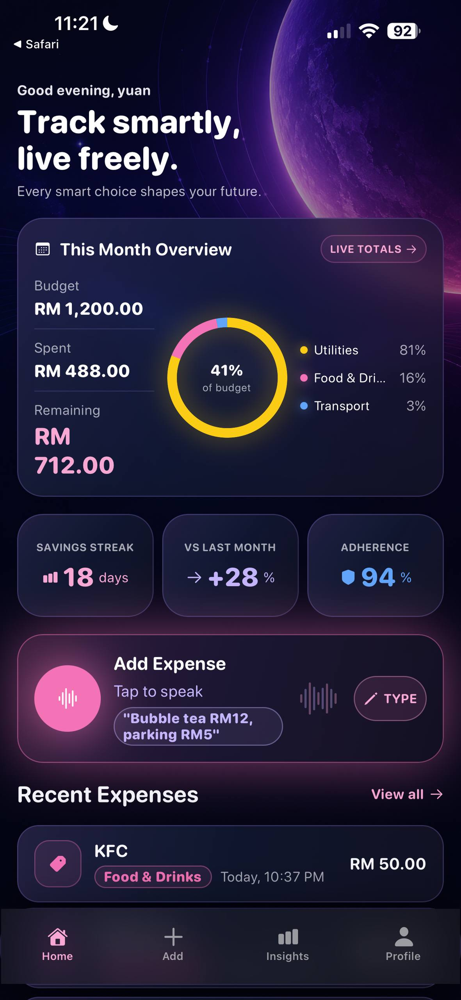
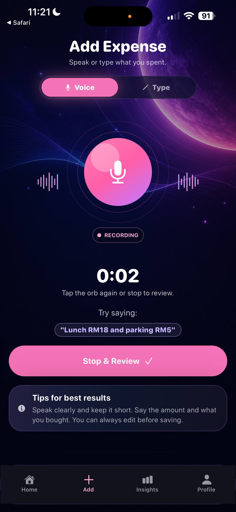
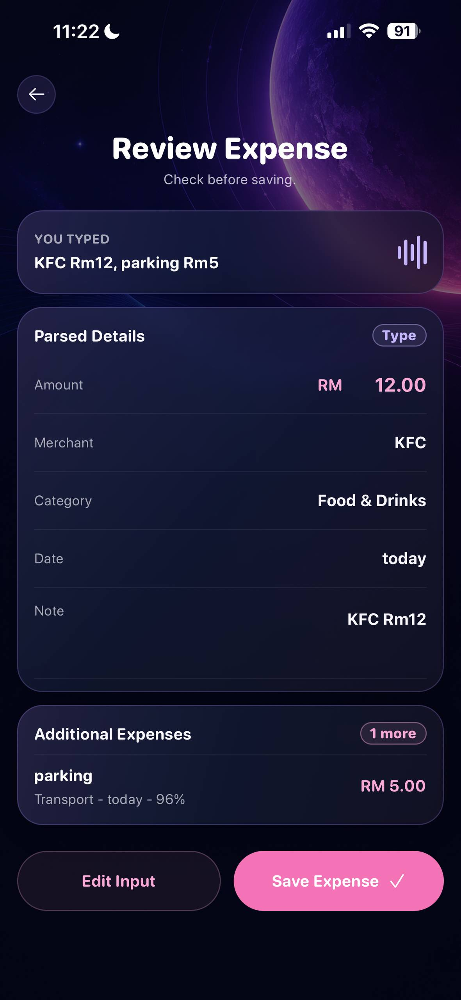
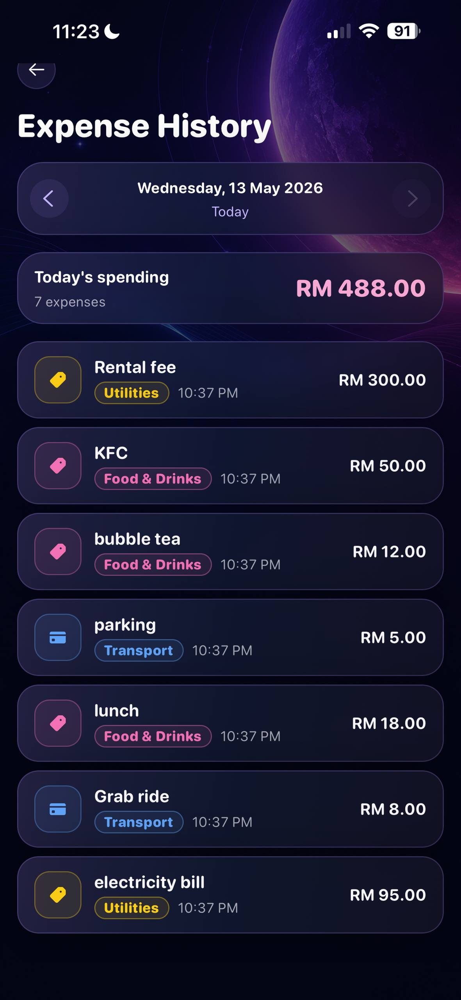
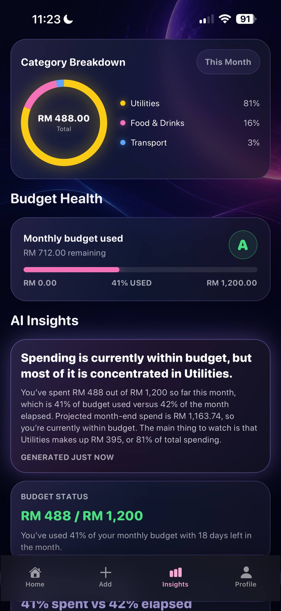
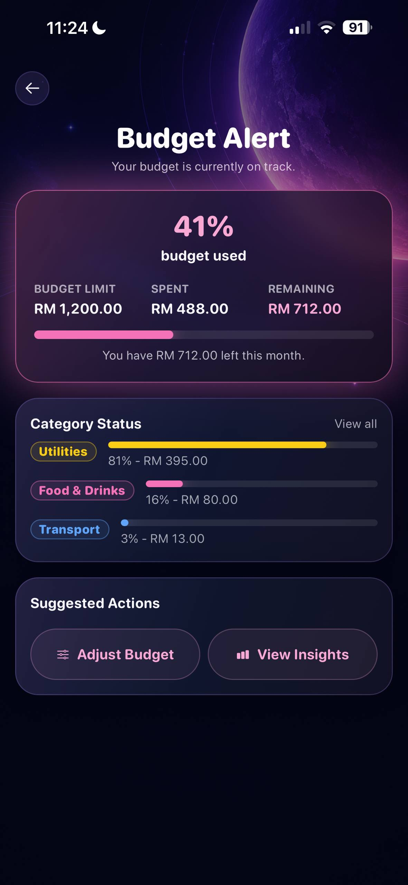
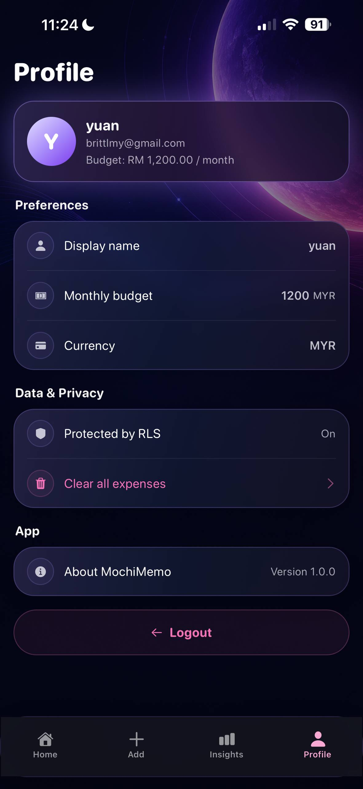

# MochiMemo

> AI voice-first spending tracker for students and young professionals.



> **Note:** Add app screenshots to `docs/images/` before publishing. See [docs/SCREENSHOTS.md](docs/SCREENSHOTS.md) for naming and capture instructions.

---

## 📖 Overview

MochiMemo is a mobile spending tracker that lets users log expenses by voice or text. It uses AI to transcribe speech, extract structured expense details, and generate spending insights based on real monthly data. Built with Expo React Native, Supabase, and OpenAI, with all user data protected by Supabase Row Level Security.

---

## 🎬 Demo

| Resource | Link |
|---|---|
| Demo Video | [Watch Demo](PASTE_YOUR_DEMO_VIDEO_LINK_HERE) |
| Demo Script | [docs/DEMO_SCRIPT.md](docs/DEMO_SCRIPT.md) |

> Replace `PASTE_YOUR_DEMO_VIDEO_LINK_HERE` with a YouTube, Google Drive, or GitHub release link after recording your demo.

---

## 📸 Screenshots

### Core App Flow

| Home | Add Expense | Review Expense |
|:---:|:---:|:---:|
|  |  |  |

### Spending Management

| History | Insights | Budget Alert |
|:---:|:---:|:---:|
|  |  |  |

### Account

| Profile |
|:---:|
|  |

For screenshot naming and capture instructions, see [docs/SCREENSHOTS.md](docs/SCREENSHOTS.md).

---

## ✨ Features

- Voice expense logging — speak your expense, AI extracts it automatically
- AI transcription via OpenAI Whisper
- AI expense extraction with structured JSON output
- Review and edit extracted expense before saving
- Type expense mode as an alternative to voice
- Supabase Auth with email/password
- User-based Row Level Security — no user can see another's data
- Editable monthly budget
- Home dashboard with category donut chart and spending overview
- Full expense history with daily date grouping
- Budget alert page
- AI-generated spending insights and recommendations
- Professional mobile UI with moon-glow glassmorphism design

---

## 🛠 Tech Stack

| Layer | Technology |
|---|---|
| Mobile | Expo React Native + TypeScript |
| Navigation | Expo Router (file-based) |
| Auth | Supabase Auth (email/password) |
| Database | Supabase Postgres + RLS policies |
| Edge Functions | Supabase Edge Functions (Deno/TypeScript) |
| AI — Transcription | OpenAI Whisper (model configurable via `OPENAI_TRANSCRIBE_MODEL`) |
| AI — Extraction | OpenAI chat model (model configurable via `OPENAI_EXPENSE_MODEL`) |
| AI — Insights | OpenAI chat model (model configurable via `OPENAI_EXPENSE_MODEL`) |
| Data fetching | TanStack React Query v5 |
| State | Zustand |
| Secure storage | Expo SecureStore |

---

## 🏗 Architecture

```
Mobile App (Expo React Native)
│
├── Supabase Auth ──────────── issues JWT on login
│
├── Supabase Edge Functions  (server-side, Deno runtime)
│   ├── transcribe-audio      receives audio, calls OpenAI Whisper
│   ├── extract-expense       receives text, calls OpenAI model
│   └── generate-insights     fetches user's data, calls OpenAI model
│       └── uses SUPABASE_SERVICE_ROLE_KEY internally (never in mobile app)
│
├── Supabase Postgres
│   ├── profiles              monthly_budget, display_name, currency
│   ├── expenses              amount, merchant, category, source, confidence
│   └── RLS policies          each user can only read/write their own rows
│
└── OpenAI API
    └── called only from Edge Functions — API key never in mobile app
```

---

## 🔄 App Flow

1. Register or log in with email and password
2. Tap **Add Expense**
3. Speak your expense (voice) or type it
4. AI transcribes speech and extracts: amount, merchant, category, date
5. Review and edit the extracted details before saving
6. Save — expense is persisted to Supabase with RLS
7. Home, History, and Insights update automatically
8. Insights tab generates personalized AI spending advice

---

## 📱 Screens

| Screen | Description |
|---|---|
| Register / Login | Email/password auth via Supabase |
| Add Expense | Voice or type mode with real-time AI status |
| Review Expense | Edit extracted fields before saving |
| Home | Monthly overview, category donut, recent expenses |
| History | All expenses grouped by date |
| Expense Detail | Full details and delete |
| Insights | Category breakdown, weekly chart, AI insights |
| Budget Alert | Budget usage and remaining balance |
| Profile | Edit display name and monthly budget |

---

## ⚙️ Environment Variables

### Mobile app

Copy `.env.example` to `.env.local` and fill in your values:

```
EXPO_PUBLIC_SUPABASE_URL=https://your-project.supabase.co
EXPO_PUBLIC_SUPABASE_ANON_KEY=your-anon-key-here
```

The Supabase anon key is safe to include in the mobile app when RLS is correctly configured.

> **Never put `OPENAI_API_KEY` in Expo environment variables.** It would be bundled into the app binary.

### Supabase Edge Functions

Set secrets via Supabase CLI — these live server-side only:

```bash
npx supabase secrets set OPENAI_API_KEY=sk-your-key
npx supabase secrets set OPENAI_EXPENSE_MODEL=gpt-4o-mini
npx supabase secrets set OPENAI_TRANSCRIBE_MODEL=gpt-4o-mini-transcribe
```

See `supabase/.env.example` for reference.

---

## 🚀 Quick Start

### Prerequisites

- Node.js 18+
- Expo Go app (iOS or Android)
- Supabase project ([supabase.com](https://supabase.com))
- OpenAI API key ([platform.openai.com](https://platform.openai.com))

### Install

```bash
git clone https://github.com/your-username/mochimemo.git
cd mochimemo
npm install
```

### Configure

```bash
cp .env.example .env.local
# Edit .env.local with your Supabase URL and anon key
```

### Supabase setup

```bash
npx supabase login
npx supabase link --project-ref your-project-ref
npx supabase db push

npx supabase secrets set OPENAI_API_KEY=sk-your-key
npx supabase secrets set OPENAI_EXPENSE_MODEL=gpt-4o-mini
npx supabase secrets set OPENAI_TRANSCRIBE_MODEL=gpt-4o-mini-transcribe

npx supabase functions deploy transcribe-audio
npx supabase functions deploy extract-expense
npx supabase functions deploy generate-insights
```

### Run

```bash
npx expo start --go -c
```

Scan the QR code with Expo Go.

See [docs/SETUP.md](docs/SETUP.md) for full setup including common errors.

---

## 🧪 Testing

1. Register a new account
2. Add a typed expense: `Bubble tea RM12, parking RM5`
3. Review extracted fields, then save
4. Check Home and History tabs
5. Record a voice expense
6. Open Insights after 3+ saved expenses
7. Edit profile to set a monthly budget
8. Add expenses until budget alert triggers

See [docs/DEMO_SCRIPT.md](docs/DEMO_SCRIPT.md) for the full demo walkthrough.

---

## 📁 Project Structure

```
app/
  (tabs)/          Tab screens: Home, Add, History, Insights, Profile
  login.tsx        Login screen
  register.tsx     Registration screen
  review-expense.tsx  Review before save
  expense-detail.tsx  Expense detail view
  history.tsx      Full expense history
  budget-alert.tsx Budget overview
components/
  ui/              Design system: GlassCard, premium components, VoiceOrb
  mochi/           Legacy mascot components (not used in current UI)
services/
  ai/              AI service layer (transcription, extraction)
  supabase/        Supabase client and data access functions
hooks/             React Query hooks and custom hooks
stores/            Zustand stores (auth, recording, UI)
types/             TypeScript interfaces (Expense, AI, Database)
utils/             Pure utilities (currency, dates, category colors)
supabase/
  functions/       Edge Functions (transcribe-audio, extract-expense, generate-insights)
  migrations/      Postgres schema and RLS migration files
docs/              Setup, architecture, security, and demo documentation
```

---

## ⚠️ Known Limitations

- Google Sign-In requires a development or production build — not available in Expo Go
- No receipt OCR scanning
- No CSV export
- No push notifications for budget alerts
- AI insights refresh is not rate-limited in the current build
- Expense editing from the detail screen is not yet implemented

---

## 🗺 Roadmap

- Edit expense from Expense Detail screen
- Receipt OCR scanning
- CSV / PDF export
- Push notification budget alerts
- Spending goals and streaks
- Weekly and monthly reports
- Google and Apple sign-in for production build
- App Store and Play Store release

---

## 🔒 Security

OpenAI API keys are stored exclusively as Supabase Edge Function secrets — never in the mobile app or public environment variables. All user data is protected by Supabase RLS policies that ensure strict per-user isolation.

See [docs/SECURITY.md](docs/SECURITY.md) for full security details.

---

## 📚 Docs

- [Setup Guide](docs/SETUP.md)
- [Architecture](docs/ARCHITECTURE.md)
- [Features](docs/FEATURES.md)
- [Security](docs/SECURITY.md)
- [Demo Script](docs/DEMO_SCRIPT.md)
- [Screenshot Guide](docs/SCREENSHOTS.md)

---

## License

MIT
